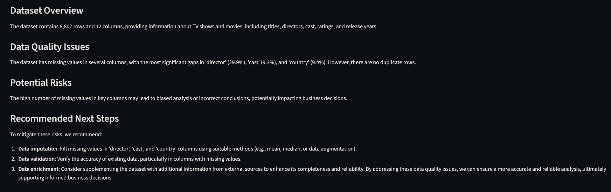
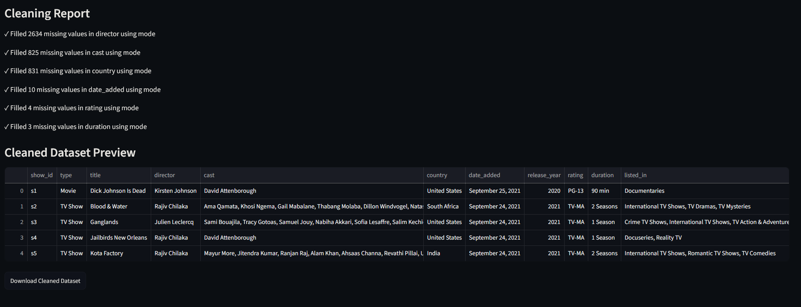
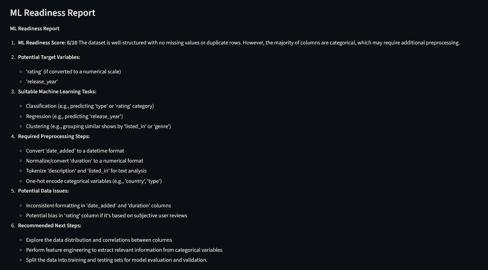

# Multi-Agent AI Data Analyst

## Live Demo

https://multi-agent-ai-data-analyst.streamlit.app/

## Overview


Multi-Agent AI Data Analyst is an agentic AI system that automates dataset analysis using specialized AI agents. The platform profiles datasets, generates natural-language insights, recommends data-cleaning actions, and evaluates machine learning readiness through an interactive Streamlit interface.

## Features

### Dataset Profiling Agent

* Dataset shape analysis
* Data type detection
* Missing value analysis
* Duplicate detection
* Statistical profiling

### Dataset Summarizer Agent

* AI-generated dataset summaries
* Executive-level insights
* Key observations and recommendations

### Data Cleaning Agent



* Missing value recommendations
* Duplicate handling suggestions
* Data quality assessment

### ML Readiness Agent



* Machine learning suitability assessment
* Feature engineering suggestions
* Encoding recommendations
* Readiness scoring

## Tech Stack

* Python
* Streamlit
* Pandas
* LangChain
* Groq
* dotenv

## Architecture

CSV Upload
↓
Dataset Profiling Agent
↓
Dataset Summarizer Agent
↓
Data Cleaning Agent
↓
ML Readiness Agent
↓
Streamlit Dashboard

## Installation

```bash
git clone https://github.com/vikas12900/multi-agent-ai-data-analyst.git
cd multi-agent-ai-data-analyst
pip install -r requirements.txt
streamlit run app.py
```

## Environment Variables

Create a `.env` file:

```env
GROQ_API_KEY=your_api_key_here
```

## Future Improvements

* LangGraph orchestration
* Visualization agent
* Automated data cleaning
* PDF report generation
* Conversational dataset Q&A
